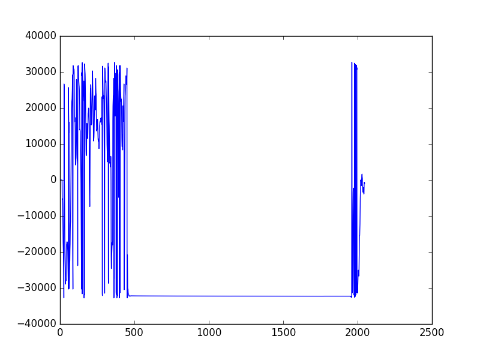

# Overview

This is the basic Python library to read data from the Data API (http://ui-data-api.psi.ch). The library accesses the data via the DataAPI REST service and loads it into a Pandas DataFrame (see: http://pandas.pydata.org/).

>What is a Pandas DataFrame? Think about it as a big table, where all values are indexed using either the `global timestamp` or the `pulse_id`. This allows you to execute statistical operations, correlations, filtering etc in a very easy and efficient way. More about Pandas you can find here:
* http://pandas.pydata.org/index.html
* http://pandas.pydata.org/pandas-docs/stable/10min.html


# Usage
## from python interpreter
Import library:

```python
import data_api as api
```

Search for channels:

```python
channels = api.search("SINSB02-RIQM-DCP10:FOR-PHASE")
```

The channels variable will hold something like this:
```python
[{'backend': 'sf-databuffer',
  'channels': ['SINSB02-RIQM-DCP10:FOR-PHASE',
   'SINSB02-RIQM-DCP10:FOR-PHASE-AVG']},
 {'backend': 'sf-archiverappliance',
  'channels': ['SINSB02-RIQM-DCP10:FOR-PHASE-AVG-P2P',
   'SINSB02-RIQM-DCP10:FOR-PHASE-JIT-P2P',
   'SINSB02-RIQM-DCP10:FOR-PHASE-STDEV']}]
```

Get data:

```python
import datetime
now = datetime.datetime.now()
end = now-datetime.timedelta(minutes=1)
start = end-datetime.timedelta(seconds=10)
data = api.get_data(channels=['SINSB02-RIQM-DCP10:FOR-PHASE'], start=start, end=end)
```

Show head of datatable:
```python
data.head()
```

Find all data corresponding to given index:
```python
data.loc["1468476300.047550981"]
```

Plot data:
```python
import matplotlib.pyplot as plt
data.plot.scatter("SINSB02-RIQM-DCP10:FOR-PHASE-AVG", "SINSB02-RKLY-DCP10:FOR-PHASE-AVG")
plt.show()
```


```python
import matplotlib.pyplot as plt
data[['SINSB02-RIQM-DCP10:FOR-PHASE-AVG', ]].plot.box()
plt.show()
```


Plot waveforms:
```python
plt.plot(data['SINSB02-RIQM-DCP10:FOR-PHASE']['1468476300.237551000'])
plt.show()
```



Find where you have data:
```
data[data['SINSB02-RIQM-DCP10:FOR-PHASE'].notnull()]
```

Save data:

```python
# to csv
data.to_csv("test.csv")

# to hdf5
data.to_hdf("test.h5", "/dataset")
```

## from command line interface

```
$ data_api -h
usage: data_api [-h] [--regex REGEX] [--from_time FROM_TIME]
                [--to_time TO_TIME] [--from_pulse FROM_PULSE]
                [--to_pulse TO_PULSE] [--channels CHANNELS]
                [--filename FILENAME] [--print]
                action

Command line interface for the Data API

positional arguments:
  action                Action to be performed. Possibilities: search, save

optional arguments:
  -h, --help            show this help message and exit
  --regex REGEX         String to be searched
  --from_time FROM_TIME
                        Start time for the data query
  --to_time TO_TIME     End time for the data query
  --from_pulse FROM_PULSE
                        Start pulseId for the data query
  --to_pulse TO_PULSE   End pulseId for the data query
  --channels CHANNELS   Channels to be queried, comma-separated list
  --filename FILENAME   Name of the output file
  --print               Prints out the downloaded data. Output can be cut.
```

# Examples

If you want to run our Jupyter Notebook examples, please clone this repository locally, then:
```
cd examples
ipython notebook
```

# Installation

You can install through our Anaconda repository:

```
conda install -c paulscherrerinstitute data_api
```
