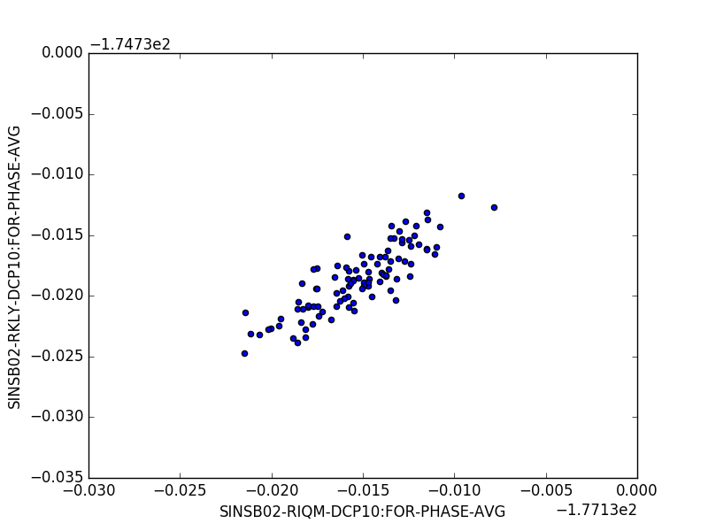
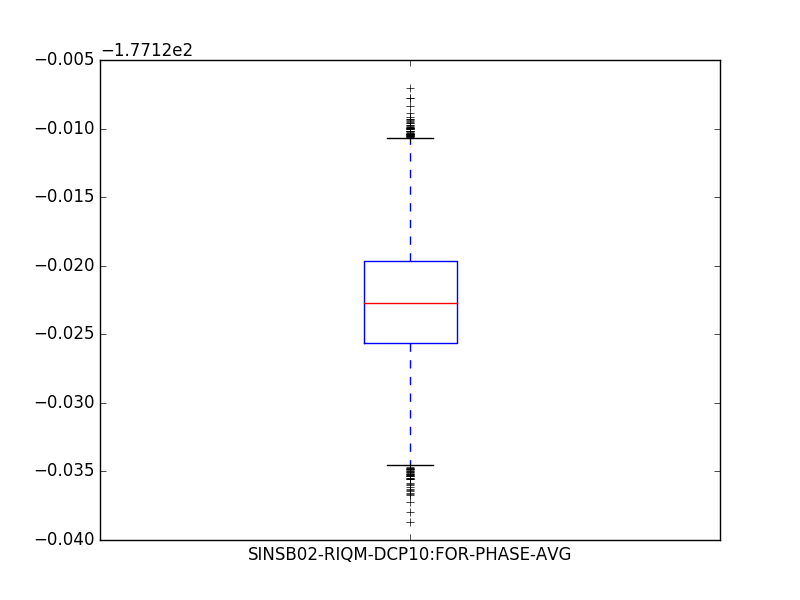

# Overview

This package gives access to the data in the PSI archiving systems. It can be used to download channel data given a specific time range.
For historic reasonst there are right now different modules for the different versions of APIs these archiving systems expose. In future the those modules will be merged and old versions will be removed.

Short overview  about some modules (see below for details):

Module `data_api.client` returns data as Pandas data frame.
This is the current way to access the __DataBuffer__.
Works with the current databuffer server at https://data-api.psi.ch but
has problems with duplicate timestamps, stray NaN values and inefficient transfers.

Module `data_api3.h5` saves data as HDF5.
This is the current way to access the __ImageBuffer__.
Only available with imagebuffer and a pre-release service for databuffer within the machine network.
This will become the recommended usage also for databuffer.


# Installation

Install via Anaconda/Miniconda:

```
conda config --prepend channels paulscherrerinstitute
conda install data_api
```

# Usage from commandline with current https://data-api.psi.ch

```bash
data_api save --filename output.h5 --from_time 2020-10-08T19:30:00Z --to_time 2020-10-08T19:31:00Z --channels SARES11-LSCP10-FNS:CH0:VAL_GET,SARES11-LSCP10-FNS:CH3:VAL_GET
```

# Usage from commandline with pre-release service

This newer service is currently in testing and so far only reachable inside the machine network.

```bash
api3 --baseurl http://sf-daqbuf-33.psi.ch:8371/api/1 --default-backend sf-databuffer save output.h5 2020-10-08T19:30:00+00 2020-10-08T19:33:00+00 SARES11-LSCP10-FNS:CH0:VAL_GET SARES11-LSCP10-FNS:CH3:VAL_GET
```

# Usage as library with pre-release service

## SF-databuffer

```python
import data_api3
import data_api3.h5
query = {
  "channels": ["SARES11-LSCP10-FNS:CH0:VAL_GET", "SARES11-LSCP10-FNS:CH3:VAL_GET"],
  "range": {
    "startDate": "2020-10-08T19:30:00Z",
    "endDate": "2020-10-08T19:31:00Z",
  },
}
data_api3.h5.request(query, baseurl="http://sf-daqbuf-33.psi.ch:8371/api/1", filename="output.h5", default_backend="sf-databuffer")
```

## SF-imagebuffer

```python
import data_api3
import data_api3.h5
query = {
  "channels": ["SOME-CAMERA:FPICTURE"],
  "range": {
    "startDate": "2020-10-08T19:30:00Z",
    "endDate": "2020-10-08T19:31:00Z",
  },
}
data_api3.h5.request(query, baseurl="http://sf-daq-5.psi.ch:8371/api/1", filename="output.h5", default_backend="sf-imagebuffer")
```

# Usage as library with default service

```python
import data_api as api
```

Search for channels:

```python
channels = api.search("SINSB02-RIQM-DCP10:FOR-PHASE")
```

The channels variable will hold something like this:
```python
[{'backend': 'sf-databuffer',
  'channels': ['SINSB02-RIQM-DCP10:FOR-PHASE',
   'SINSB02-RIQM-DCP10:FOR-PHASE-AVG']},
 {'backend': 'sf-archiverappliance',
  'channels': ['SINSB02-RIQM-DCP10:FOR-PHASE-AVG-P2P',
   'SINSB02-RIQM-DCP10:FOR-PHASE-JIT-P2P',
   'SINSB02-RIQM-DCP10:FOR-PHASE-STDEV']}]
```

Get data by global timestamp:

```python
import datetime
now = datetime.datetime.now()
end = now-datetime.timedelta(minutes=1)
start = end-datetime.timedelta(seconds=10)
data = api.get_data(channels=['SINSB02-RIQM-DCP10:FOR-PHASE'], start=start, end=end)
```

In the case to query a specific backend specify the base_url option in the `get_data` call.  For example for hipa use `api.get_data(... base_url='https://data-api.psi.ch/hipa')`


Get data by pulseId:

```python
import datetime
start_pulse_id = 123456
stop_pulse_id = 234567
data = api.get_data(channels=['SINSB02-RIQM-DCP10:FOR-PHASE'], start=start_pulse_id, end=stop_pulse_id, range_type="pulseId")
```

Get approximate pulseId by global timestamp:

**Warning**: This will not give you an exact pulse_id, just the closest pulse_id in the data buffer from the
global timestamp you requested. The pulse id might be skewed by maximum 30 seconds.

```python
from datetime import datetime
global_timestamp = datetime.now()

# If you do not pass a global_timestamp, the current time will be used.
pulse_id = api.get_pulse_id_from_timestamp(global_timestamp)
```

Show head of datatable:
```python
data.head()
```

Find all data corresponding to given index:
```python
data.loc["1468476300.047550981"]
```

Plot data:
```python
import matplotlib.pyplot as plt
data.plot.scatter("SINSB02-RIQM-DCP10:FOR-PHASE-AVG", "SINSB02-RKLY-DCP10:FOR-PHASE-AVG")
plt.show()
```



```python
import matplotlib.pyplot as plt
data[['SINSB02-RIQM-DCP10:FOR-PHASE-AVG', ]].plot.box()
plt.show()
```




Plot waveforms:
```python
plt.plot(data['SINSB02-RIQM-DCP10:FOR-PHASE']['1468476300.237551000'])
plt.show()
```


Find where you have data:
```
data[data['SINSB02-RIQM-DCP10:FOR-PHASE'].notnull()]
```

Save data:

```python
# to csv
data.to_csv("test.csv")

# to hdf5
data.to_hdf("test.h5", "/dataset")
```

## Use Server-Side Aggregation

To minimize data transfer requirements, data can be requested in an aggregated way from the API. The server than takes care of aggregating the values and only send the aggregated values to the client.

```Python
import data_api as api
import datetime
now = datetime.datetime.now()
end = now-datetime.timedelta(minutes=1)
start = end-datetime.timedelta(seconds=10)


aggregation = api.Aggregation(aggregation_type="value", aggregations=["min", "mean", "max"], extrema=None, nr_of_bins=None, duration_per_bin=None, pulses_per_bin=None) # Just set the parameters you explicitly want to set - this example is showing the defaults - for more details about the parameters and their effect see https://git.psi.ch/sf_daq/ch.psi.daq.queryrest#data-aggregation

data = data_api.get_data(channel_list, start=start, end=end, aggregation=aggregation)
```

For more details on the aggregation values and their effects see: https://git.psi.ch/sf_daq/ch.psi.daq.queryrest#data-aggregation

## Query Specific Backend
By default the data API first queries the DataBuffer for the channel, if the channel is not found there, it then does a query to the Epics Archiver.

If you want to explicitly specify which backend/system the channel should be queried from you can prepend the channel name with either *sf-databuffer/* or *sf-archiverappliance/*

```
"sf-databuffer/CHAN1"
# or
"sf-archiverappliance/CHAN1"
```

## Query For PulseId Global Timestamp Mapping

To find the correspondig global timestamp of a given pulseid this method can be used:
```python
import data_api as api

api.get_global_date(pulseid)

# Query for multiple pulseids mappings
api.get_global_date([pulseid1, pulseid2])
```

The method accepts a single or multiple pulseids and returns a list of global dates for the specified pulseids.
By default the method uses the beam ok channel (SIN-CVME-TIFGUN-EVR0:BUNCH-1-OK)
to do the mapping. If the mapping cannot be done the method raises an ValueException.
In that case a different mapping channel via the functions optional parameter `mapping_channel` can be specified

# Command Line Interface
The packages functionality is also provided by a command line tool. On the command line data can be retrieved as follow:

```
$ data_api -h
usage: data_api [-h] [--regex REGEX] [--from_time FROM_TIME]
                [--to_time TO_TIME] [--from_pulse FROM_PULSE]
                [--to_pulse TO_PULSE] [--channels CHANNELS]
                [--filename FILENAME] [--overwrite] [--split SPLIT] [--print]
                [--binary]
                action

Command line interface for the Data API

positional arguments:
  action                Action to be performed. Possibilities: search, save

optional arguments:
  -h, --help            show this help message and exit
  --regex REGEX         String to be searched
  --from_time FROM_TIME
                        Start time for the data query
  --to_time TO_TIME     End time for the data query
  --from_pulse FROM_PULSE
                        Start pulseId for the data query
  --to_pulse TO_PULSE   End pulseId for the data query
  --channels CHANNELS   Channels to be queried, comma-separated list
  --filename FILENAME   Name of the output file
  --overwrite           Overwrite the output file
  --split SPLIT         Number of pulses or duration (ISO8601) per file
  --print               Prints out the downloaded data. Output can be cut.
  --binary              Download as binary
```

To export data to a hdf5 file the command line tool can be used as follows:

```bash
data_api --from_time "2017-10-30 10:59:45.788" --to_time "2017-10-30 11:00:45.788" --channels S10CB01-RLOD100-PUP10:SIG-AMPLT-AVG --filename testit.h5  save
```

__To improve download speeds use the `--binary` option for saving data into a hdf5 file.__

As downloads might be pretty big and if you are not using the `--binary` option the current implementation need to keep all data in memory before writing you have to use the `--split` option to split up the data files.
When having this option specified the query will be split in several smaller queries.

In case of an pulse based query this argument takes an integer, in case of a time based query it takes an [ISO8601](https://en.wikipedia.org/wiki/ISO_8601#Durations) duration string.
Please note that in the case of duration year and month durations are not supported!

Pulse based query:
```bash
data_api --from_pulse 5166875100 --to_pulse 5166876100 --channels sf-databuffer/SINEG01-RCIR-PUP10:SIG-AMPLT --split 500 --filename testit.h5 save
```

Time based query:
```bash
data_api --from_time "2018-04-05 09:00:00.000" --to_time "2018-04-05 10:00:00.000" --channels sf-databuffer/SINEG01-RCIR-PUP10:SIG-AMPLT --split PT30M --filename testit.h5 save
```

Example durations:
* *PT2M* - 2 minutes
* *PT1H2M* - 1 hour and 2 minutes
* *PT10S* - 10 seconds
* *P1W* - 1 week
* *P1DT6H* - one day and 6 hours

# Examples

## Jupyter Notebook
If you want to run our Jupyter Notebook examples, please clone this repository locally, then:
```
cd examples
ipython notebook
```
